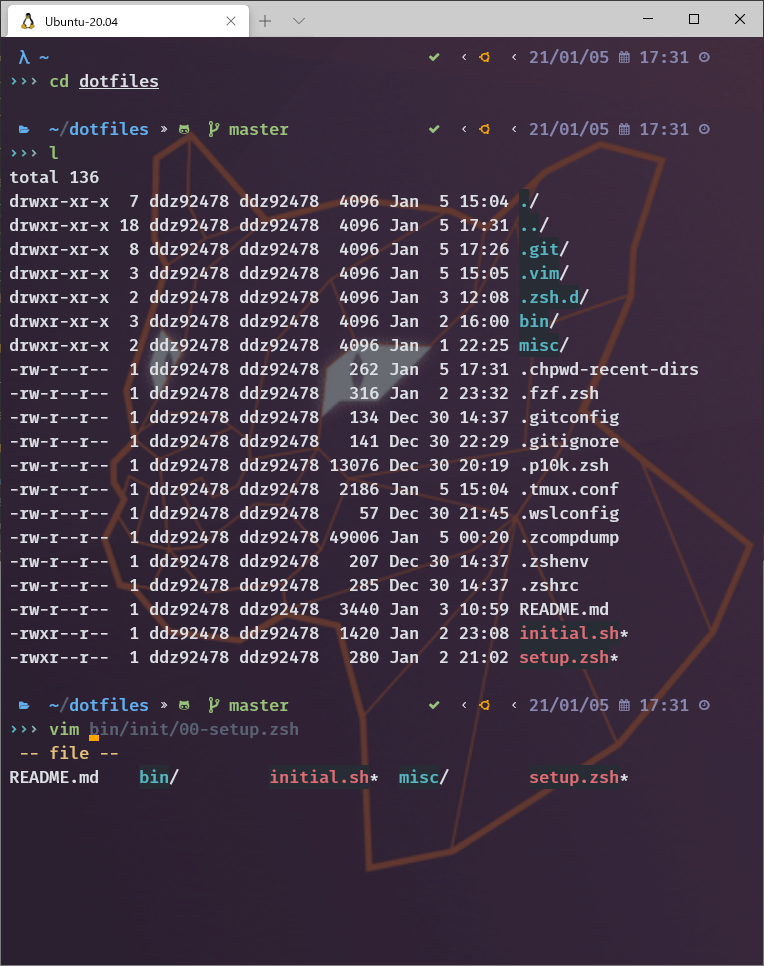
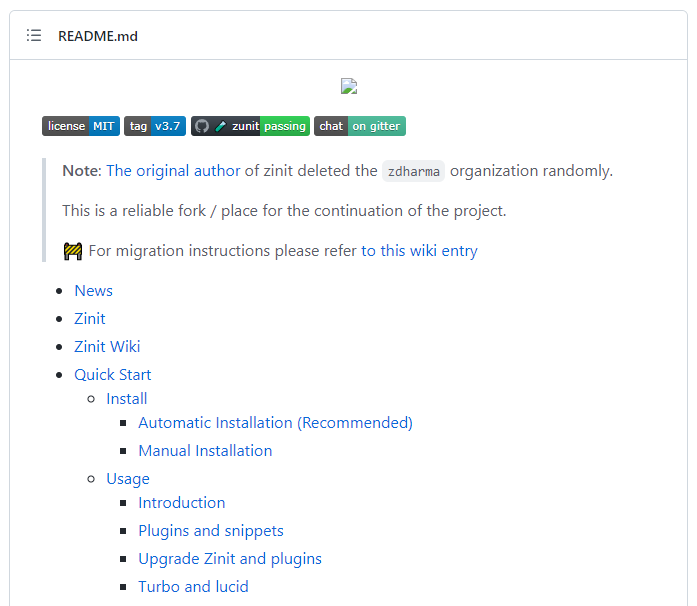
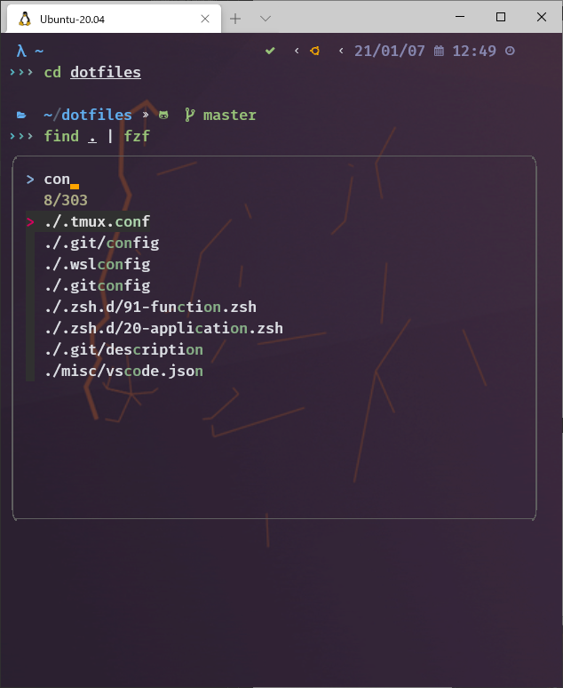
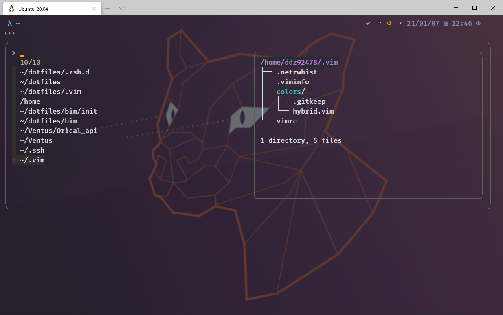
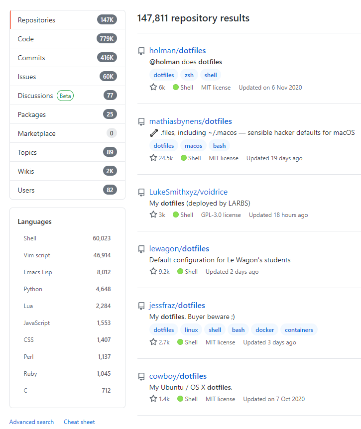

<!--
theme: gaia
size: 16:9
paginate: true
style: |
  section {
    background-color: #FFFFFF;
    font-size: 24px;
  }
  section.title h1 {
    font-size: 64px;
  }
footer: "から皆のターミナル環境も教えてほしい(本音)"
-->

<!-- _class: title -->

# 俺のターミナル環境を晒す 2022

## 見た目だけじゃない！高機能かつ高速な環境を Git で管理しよう！

 

### Presented by _inokuchi_

---

<!--
_style: |
  section.lead h1 {
    text-align: center;
  }
_class: lead
header: ""
footer: "俺のターミナル環境を晒す 2022"
-->

# Q: 新しい PC を買った！開発環境どうしよう？

---

<!--
header: Q: 新しい PC を買った！開発環境どうしよう？
-->

---

<!--
header: A: dotfiles を作ろう！
-->

# 今日の話題

## 1. 私のターミナル史

## 2. ターミナルをカスタマイズして幸せになろう

## 3. dotfiles のすゝめ

<!--
(何かしらの)端末として動作するソフトウェアを指すことが一般的
様々なOS上で様々なシェルを使い、開発する

今日取り上げるのは、TeraTermやPuTTYなどのSSHクライアントなどではなく、
ふつうのGUIターミナルアプリケーションです。
MACで言えば標準のターミナルやiTerm2など、Windowsで言えばmintty。
-->

---

<!--
_style: |
  section.lead h1 {
    text-align: center;
  }
_class: lead
header: ""
footer: "俺のターミナル環境を晒す 2022"
-->

# 1. 私のターミナル史

---

<!--
header: 1. 私のターミナル史
-->

# 1.1. 2019 年初期の私のターミナル

- こういう環境で作業してました。イケてないですねぇ
- そもそも WSL ではなく **Git for Windows** や **Cygwin** を使っていた
  - 「Windows は開発に向かない」と言われても仕方ないね…

<!--
Cygwin：UNIX系コマンドを入力できるような偽物
（それを言ったらWSL1も互換レイヤなのでニセモノだけど…）

当時はWindowsでまともにUNIX系コマンドを操作することは出来ませんでした。
しかしあまり知識を持ち合わせていない僕はそれほど苦に感じていない節もありました。無知は怖い。
 -->

---

# 1.2. 2019 年後期のターミナル

- かなり進化した。
- [Cmder](https://cmder.net/) と呼ばれるターミナルエミュレータを導入したことで、WSL をカスタマイズ可能に。
- プロンプトは Powerline でデザイン。(実はこの時作ったものを今でもベースとして使っている)

---

<!--
_style: |
  section.lead h1 {
    text-align: center;
  }
_class: lead
header: ""
footer: "俺のターミナル環境を晒す 2022"
-->

# 1.3. 2021 年現在の私のターミナルは…

---

<!--
header: 1. 私のターミナル史
-->

# 美しい…

---

<!--
_style: |
  section.lead h1 {
    text-align: center;
  }
_class: lead
header: ""
-->

# 2. ターミナルをカスタマイズして幸せになろう

ここからが本題です

---

<!--
_style: |
  section.lead h1 {
    text-align: center;
  }
_class: lead
header: 2. ターミナルをカスタマイズして幸せになろう
-->

# 3 つのポイント

## 見た目：**Powerlevel10K**

## 機能：**zinit** / **fzf**

## 管理：**dotfiles**

---

# 2.0. 構成

- OS: **WSL2**
- シェル：**Zsh**
- プラグインマネージャ：**zinit** (旧名 zplugin)
- カラープラグイン：**Powerlevel10k**
- 補足
  - vimmer じゃないので vim のプラグイン管理はしていない
  - tmux の設定も最低限
  - なので本格派には怒られそう :sweat_smile:

---

<!--
_style: |
  section.lead h1 {
    text-align: center;
  }
_class: lead
_header: ""
-->

# ターミナルの見た目をカラフルにしたい…

---

## 2.1. 見た目：**Powerlevel10K**

特長

- 見やすく、情報量の多いプロンプト
  - パス、Git、OS アイコン、日付時刻
  - その他仮想環境の情報など
- `ls` コマンドの適切な色分け (違うかも)
- **高速** ← 大事
- Windows Terminal は神。

課題

- ドキュメントが渋い :angry:
  - [先人](https://github.com/Powerlevel9k/powerlevel9k/wiki/Show-Off-Your-Config) は神 :angel:
- 9K の設定ベタ書きをそのまま移行している

---

<!--
_style: |
  section.lead h1 {
    text-align: center;
  }
_class: lead
_header: ""
-->

# Zsh のプラグインを管理したい…

---

## 2.2.1. 機能：**zinit**

特長

- [**高速**](https://twitter.com/inox4629music/status/1321678326222606337/photo/1)なプラグインマネージャ
  - 有名な Zplug や OhMyZsh と比較して圧倒的
- 簡単に導入できる
  - `.zshrc` に書き込むだけ
  <!-- - Prezto のような独自管理機能は無く、
    ただ `~/.zinit` にインストールされるだけ -->
- 充実したプラグイン
  - No **autocomplete/autosuggestions**, No Life.
  - OMZ や Prezto の部分機能も取り入れられる

課題

- ドキュメントが渋い :rage:
  - 先人は神 :angel:
- STOP！OSS へのフリーライド

---

<!--
_style: |
  section.lead h1 {
    text-align: center;
  }
_class: lead
header: ""
-->

# もっと高速にターミナルを操作したい…

---

<!--
  header: 2. こだわりポイント解説
-->

## 2.2.2. 機能： :star: **fzf** :star:

特長

- これなしには生きられない
- `fzf` コマンドに渡すだけで、
  標準出力の結果を曖昧検索(=fuzzy finder)してくれる
- 例 1：`find . | fzf`

---

## 2.2.2. 機能：:star: **fzf** :star:

特長

- **プレビュー機能が死ぬほど便利**
  - 神。
  - peco にはない機能
- 例 2：強化版 `cd`
  - `cdr` (ディレクトリ履歴)
    　　　　＋
    `tree` (ファイルのツリー表示)

---

## 2.2.2. 機能：:star: **fzf** :star:

特長

- 例 3：強化版 `git add`

---

<!--
_style: |
  section.lead h1 {
    text-align: center;
  }
_class: lead
header: ""
-->

# 3. 環境構築、一発で終わらせたくない？

---

<!--
  header: 3. 環境構築、一発で終わらせたくない？
-->

## 3.1. 管理：dotfiles

- dotfiles とは、`~/.bashrc` や `~/.gitconfig` など
- 転じて、config ファイルらを集約したリポジトリを指す。
  - GitHub で検索すると、148k 個もヒット！
  - 24k スターを獲得しているレポジトリも。
- [特におすすめな人](https://qiita.com/yutakatay/items/c6c7584d9795799ee164#%E7%89%B9%E3%81%AB%E3%81%8A%E3%81%99%E3%81%99%E3%82%81%E3%81%AA%E4%BA%BA) より引用

---

<!--
_style: |
  section.lead h1 {
    text-align: center;
  }
_class: lead
-->

# [作ってみた](https://github.com/inox-ee/dotfiles)

---

<!--
_style: |
  section.lead h1 {
    text-align: center;
  }
_class: lead
-->

# [やってみた](https://drive.google.com/file/d/1fjEe0rrdwMIyxr-znt892fK9DRKEzDjv/view?usp=sharing)

---

<video
  src="./imgs/dotfiles.mp4"
  width="1130"
  height="550"
  controls>
</video>

---

<!--
_style: |
  section.lead h1 {
    text-align: center;
  }
_class: lead
-->

# まとめ

---

<!--
_style: |
  section.lead h1 {
    text-align: center;
  }
_class: lead
header: "まとめ"
-->

# A: 最強ターミナルを詰め込んだ   世界に一つだけの dotfiles を作ろう！
